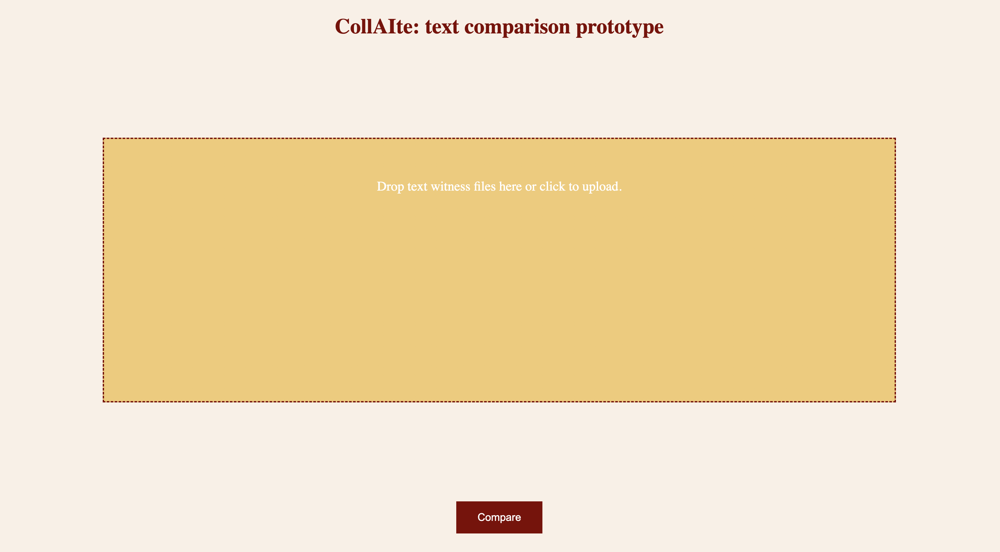
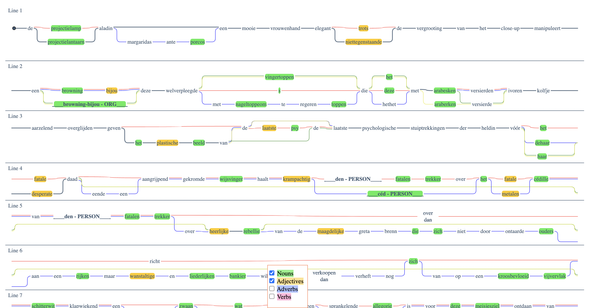

# Visualisation tools for the CollAIte project

A repository for storing code on visualisation of textual witnesses for the CollAIte project.

### TRAViz extension

The tool located in the ``traviz-extension/`` directory is an experimental visualisation tool for comparing text witnesses. It is based on the TRAViz extension which is released under the [Fair Academic License (FAL)](http://vizcovery.org/fal.html)

##### Building the extension from source  
  
  
Requirements: 

* [Git](https://git-scm.com/)
* [Python](https://www.python.org/downloads/) 3.8+

Steps:

1. Get a copy of the code:

        git clone git@github.com:collaite/visualisation-tools.git
    
2. Change into the `visualisation-tools/traviz-extension/` directory

3. Create a new Python virtual environment with the following command: `python3 -m venv path/to/new/virtual/environment`

4. Activate this new virtual environment using the command: `source path/to/new/virtual/environment/bin/activate`

5. Type `pip install -r requirements.txt` to install required libraries

6. After the required libraries have been installed, type: `python app.py`

7. Navigate to: `http://127.0.0.1:5000` in your browser (I strongly recommend to use [Chrome](https://www.google.com/chrome))

8. You should be able to see the main screen of the visualisation prototype (see below for a screenshot). If you do not see this screen or you receive an error message, please file an issue [here](https://github.com/collaite/visualisation-tools/issues)

##### Main screen

##### Results screen

##### License

Copyright (2022) Kody Moodley

Licensed under the Apache License, Version 2.0 (the "License"); you may not use this file except in compliance with the License. You may obtain a copy of the License at

[http://www.apache.org/licenses/LICENSE-2.0](http://www.apache.org/licenses/LICENSE-2.0)
    
Unless required by applicable law or agreed to in writing, software distributed under the License is distributed on an "AS IS" BASIS, WITHOUT WARRANTIES OR CONDITIONS OF ANY KIND, either express or implied. See the License for the specific language governing permissions and limitations under the License.